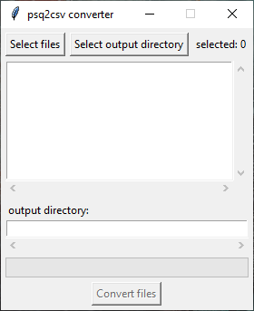
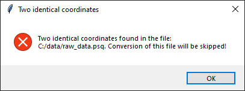

# Konwerter plików psq do csv
Zadaniem konwertera jest konwersja danych z plików `*.psq` do plików w formacie `*.csv` z danymi w formie binarnej.

Plik w formacie `*.psq` jest plikiem zawierającym informacje o przeprowadzonej rozgrywce w grze Gomoku. Format ten jest obecnie używany przez [Gomocup](https://gomocup.org/), czyli ogólnoświatowy turniej sztucznej inteligencji grającej w Gomoku i Renju. Pliki są obsługiwane przez menager Gomoku [Piskvork](https://github.com/plastovicka/Piskvork). 

W tym formacie można znaleźć następujące informacje dotyczące rozegranej partii:
- rozmiar planszy
- poziom przeciwników
- przeciwnik rozpoczynający partię
- współrzędne kolejnych ruchów przeciwników
- czas wykonywania ruchu
- nazwy przeciwników (tylko w rozgrywce turniejowej)
- kod błędu

## Przeznaczenie programu
Konwerter ten jest potrzeby w ramach pracy magisterskiej pt. *Program grający w kółko i krzyżyk wykorzystujący rachunek zdań* (ang. *Gomoku playing program using propositional calculus*).

## Struktura plików `*.csv`
Do stworzenia pliku `*.csv` konwerter potrzebuje informacji o rozmiarze planszy oraz współrzędnych kolejnych ruchów przeciwników. Na podstawie tych informacji generuje plik o następującej strukturze:

|      player     | 0player_field_N | 1player_field_N | ... | player_decision_N | ... |
|:---------------:|:---------------:|:---------------:|:---:|:-----------------:|-----|
| wartość binarna | wartość binarna | wartość binarna | ... |  wartość binarna  | ... |
| wartość binarna | wartość binarna | wartość binarna | ... |  wartość binarna  | ... |

Wartości binarne w danych to 0 lub 1. Kolumna **player** informuje, którego gracza jest teraz kolej. Kolumny **0player_field_N** i **1player_field_N** informują czy pole planszy **N** jest zajęte przez gracza 0 lub 1. Dla przykładu kolumna informująca o tym, że gracz 1 zajął pole planszy o numerze 24 to **1player_field_24**. Kolumny oznaczone jako **player_decision_N** mówią o tym które pole planszy dany gracz wybrał.

## Jak pobrać i uruchomić konwerter
Po pobraniu repozytorium:

```
cd mgr-konwerter
python3 converter.py
```

## Jak przekonwertować pliki


Aby przekowertować pliki należy kliknąć `Select files` po czym wybrać pliki z roszerzeniem `*.psq`. Następnie należy wybrać ścieżkę, gdzie umieścić przekonwertowane pliki `*.csv`. Teraz po kliknięciu `Convert fiels` nastąpi konwersja. Program poinformuje użytkownika natrafionych błędach podczas konwersji, na przykład:


